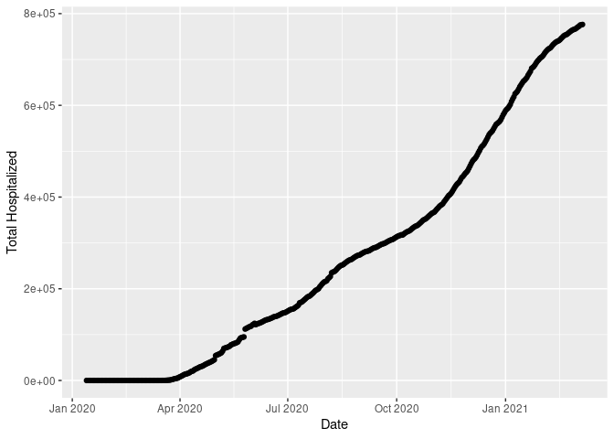

Activity 2
================

``` r
df <- readr::read_csv("https://covidtracking.com/data/download/all-states-history.csv")
```

    ## Warning: One or more parsing issues, call `problems()` on your data frame for details,
    ## e.g.:
    ##   dat <- vroom(...)
    ##   problems(dat)

    ## Rows: 20780 Columns: 41
    ## ── Column specification ────────────────────────────────────────────────────────
    ## Delimiter: ","
    ## chr   (1): state
    ## dbl  (37): death, deathConfirmed, deathIncrease, deathProbable, hospitalized...
    ## lgl   (2): negativeTestsPeopleAntibody, positiveTestsPeopleAntibody
    ## date  (1): date
    ## 
    ## ℹ Use `spec()` to retrieve the full column specification for this data.
    ## ℹ Specify the column types or set `show_col_types = FALSE` to quiet this message.

``` r
df
```

    ## # A tibble: 20,780 × 41
    ##    date       state death deathConfirmed deathIncrease deathProbable
    ##    <date>     <chr> <dbl>          <dbl>         <dbl>         <dbl>
    ##  1 2021-03-07 AK      305             NA             0            NA
    ##  2 2021-03-07 AL    10148           7963            -1          2185
    ##  3 2021-03-07 AR     5319           4308            22          1011
    ##  4 2021-03-07 AS        0             NA             0            NA
    ##  5 2021-03-07 AZ    16328          14403             5          1925
    ##  6 2021-03-07 CA    54124             NA           258            NA
    ##  7 2021-03-07 CO     5989           5251             3           735
    ##  8 2021-03-07 CT     7704           6327             0          1377
    ##  9 2021-03-07 DC     1030             NA             0            NA
    ## 10 2021-03-07 DE     1473           1337             9           136
    ## # ℹ 20,770 more rows
    ## # ℹ 35 more variables: hospitalized <dbl>, hospitalizedCumulative <dbl>,
    ## #   hospitalizedCurrently <dbl>, hospitalizedIncrease <dbl>,
    ## #   inIcuCumulative <dbl>, inIcuCurrently <dbl>, negative <dbl>,
    ## #   negativeIncrease <dbl>, negativeTestsAntibody <dbl>,
    ## #   negativeTestsPeopleAntibody <lgl>, negativeTestsViral <dbl>,
    ## #   onVentilatorCumulative <dbl>, onVentilatorCurrently <dbl>, …

After doing this and viewing the loaded data, answer the following
questions:

\*\* 1. What are the dimensions of the dataset? What does each row
represent? \*\* The rows represent the daily reposted cases for covid 19
reports on various parameters such as death, confirmed cases, and
others. there are 20,780 rows.

\*\* 2. Do you have multiple measurements over time? Across different
locations? Do you plan on focusing on all of these values? Do you need
to subset your dataset to be more focused? For example, we focused on
data from the year 2016 in Activity 1. \*\* The data is measured over
time since the first case of covid-19 was reported in the US. I am
focused on all the values because they are critical in tracking the
trend of covid-19 pandemic across different states in the US.

\*\* 3. What two variables are you focusing on? That is, what is your
research question and what information do you have to explore this
question? Keep in mind that for this activity we are focusing on SLR
\*\*

    The main question of this study is to determined whether there was a relationship between the number of recovered patients and the hospitalizations.

## Task 4: Explore your data

4.  Create a new R code chunk (or multiple R code chunks) and plot each
    of your variables - separately and together. Be sure to describe
    what you notice/wonder. Does the relationship look linear?

``` r
subset_data <- subset(df, select = c("date","hospitalized", "recovered")) #selected only the columns of interest


#clean the data by puting 0 where there NA values. 
#The missing values could not ben totally removed since, NA may mean that there were no recoveries or hospitalizations on specific days.

subset_data["hospitalized"][is.na(subset_data["hospitalized"])] <- 0
subset_data["recovered"][is.na(subset_data["recovered"])] <- 0

subset_data
```

    ## # A tibble: 20,780 × 3
    ##    date       hospitalized recovered
    ##    <date>            <dbl>     <dbl>
    ##  1 2021-03-07         1293         0
    ##  2 2021-03-07        45976    295690
    ##  3 2021-03-07        14926    315517
    ##  4 2021-03-07            0         0
    ##  5 2021-03-07        57907         0
    ##  6 2021-03-07            0         0
    ##  7 2021-03-07        23904         0
    ##  8 2021-03-07            0         0
    ##  9 2021-03-07            0     29570
    ## 10 2021-03-07            0         0
    ## # ℹ 20,770 more rows

``` r
library(ggplot2)
library(dplyr)
```

    ## 
    ## Attaching package: 'dplyr'

    ## The following objects are masked from 'package:stats':
    ## 
    ##     filter, lag

    ## The following objects are masked from 'package:base':
    ## 
    ##     intersect, setdiff, setequal, union

``` r
# Group by date and calculate total recovered
rec_data <- subset_data %>%
  group_by(date) %>%
  summarize(TotalRecovered = sum(recovered))

# Create scatter plot
ggplot(rec_data, aes(x = date, y = TotalRecovered)) +
  geom_point() +
  labs(x = "Date", y = "Total Recovered")
```

<!-- -->

``` r
#hospitalizations trend
hos_data <- subset_data %>%
  group_by(date) %>%
  summarize(TotalHospitalized = sum(hospitalized))

# Create scatter plot
ggplot(hos_data, aes(x = date, y = TotalHospitalized)) +
  geom_point() +
  labs(x = "Date", y = "Total Hospitalized")
```

<!-- -->

``` r
#ploting scatter plot for both
# Group by date and calculate total recovered and hospitalizations
grouped_data <- subset_data %>%
  group_by(date) %>%
  summarize(TotalRecovered = sum(recovered), TotalHospitalizations = sum(hospitalized))

# creating the visualization
ggplot(grouped_data, aes(x = date)) +
  geom_point(aes(y = TotalRecovered), color = "blue", label = "Recovered") +
  geom_point(aes(y = TotalHospitalizations), color = "red", label = "Hospitalized") +
  labs(x = "Date", y = "Count") +
  scale_color_manual(values = c("blue", "red")) +
  guides(color = guide_legend()) +
  theme_bw()
```

    ## Warning in geom_point(aes(y = TotalRecovered), color = "blue", label =
    ## "Recovered"): Ignoring unknown parameters: `label`

    ## Warning in geom_point(aes(y = TotalHospitalizations), color = "red", label =
    ## "Hospitalized"): Ignoring unknown parameters: `label`

<!-- -->

## Notable findings

The data for both recovered and hospitalized patients indicate that
since the start of Covid-19 pandemic, the number of patients
hospitalized and recovered rapidly increased. However, from the plot of
the combined data, the data suggest that the number of recoveries was
substantially higher compared to hospitalized patients. Furthermore,
from the graph, it is notable that although the initial relationship was
linear, the dependent variable (recovered cases) was not greatly
affected by number of hospitalizations - independent variable.
Therefore, the relationship not linear.

*\#Answer the following question:*

Use `statsr::plot_ss` to choose a line that does a good job of
minimizing the sum of squares. Run the function several times.

*Answer the following questions:*

5.  What was the smallest sum of squares that you got? What was the
    relationship between your line and the data points? **The smallest
    Sum of Squares: 1.392718e+15 and the relationship between the lines
    was linear. The resduals were normally distributed, no outliers.**
6.  What was the largest sum of squares you got? What was the
    relationship between your line and the data points? **The largest
    Sum of Squares: 8.062926e+15. The relationship seemed linear.**

The linear model equation is:

\_\_y\_hat = b\_1\*1.3927e+15 + 1.1385e+0.6\_\_
